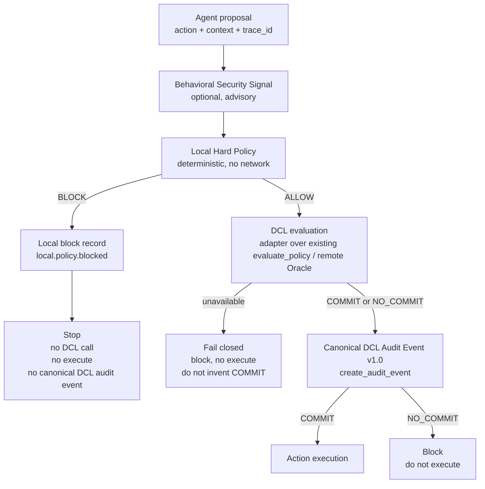

# Agent Control Architecture v0.1

Local, testable reference for how a Fronesis agent is gated **before** an
action executes. This is not a redesign of DCL Trust Oracle and does not
change production servers, payment logic, x402, ERC-8004, or Canonical DCL
Audit Event v1.0.

**Location:** `agent_control/` (dedicated local package). Production modules
such as `webhook_server.py`, `mcp_server.py`, `bazaar_server.py`, and
`payment_logger.py` are intentionally untouched.

Fronesis does not guarantee that an approved business action will produce a desirable economic outcome. DCL provides policy evaluation, enforcement decision, provenance and audit evidence.

## 1. Architecture diagram

## 2. Responsibility of each layer

| Layer | Module | Responsibility |
| --- | --- | --- |
| 1. Agent | `agent_control/actions.py` | Propose an action (`action_type` + flexible payload). Must not execute. |
| 2. Behavioral Security Signal | `agent_control/behavior.py` | Optional advisory `BehaviorSignal` (`risk_score`, `reason`, `source`). Never authorizes. |
| 3. Local Hard Policy | `agent_control/policy.py` | Deterministic ALLOW/BLOCK: amount caps, daily budget, chain/tool/destination allowlists, `require_dcl`. No network. |
| 4. DCL | `agent_control/dcl.py` | Thin adapter. Conceptual `evaluate(action, context) → COMMIT \| NO_COMMIT` mapped onto the **existing** engine, not a second DCL. |
| 5. Action execution | `agent_control/executor.py` | Runs only if local ALLOW **and** DCL COMMIT. v0.1 uses a mock executor. |
| 6. Canonical audit | `agent_control/canonical_audit.py` | After a DCL verdict, emit Canonical DCL Audit Event v1.0 via `create_audit_event(...)`. |
| Orchestrator | `agent_control/orchestrator.py` | Wires the path in order, fail-closed, same `trace_id` end to end. |

## 3. Trust boundaries

- **Agent is untrusted.** It may propose anything; it cannot execute.
- **Behavioral Security is untrusted / advisory.** A high score cannot force execution. A low or missing score cannot skip local policy or DCL.
- **Local hard policy is the emergency boundary.** It is trusted locally, runs offline, and can stop the flow before DCL is contacted.
- **DCL is the external (or in-process) policy enforcement layer.** It is authoritative for COMMIT / NO_COMMIT once invoked. It is *not* a guarantee of economic quality.
- **Executor is privileged** and must only be reached after ALLOW + COMMIT.
- **`agent_id` is contextual identity**, not implicit verification (ERC-8004 / identity-guard remain separate, authoritative components).

## 4. Fail-closed semantics

Default: **DCL unavailable ≠ COMMIT.** v0.1 never fails open.

| DCL state | Result |
| --- | --- |
| Available + COMMIT | Execute (after local ALLOW) |
| Available + NO_COMMIT | Block; still emit canonical audit event |
| Unavailable (error or `available=False`) | Block; do not execute; do not invent COMMIT |

`DCLAvailabilityPolicy` is the extension point for future fallback modes.
Only `FAIL_CLOSED` is implemented. Passing any other policy raises
`NotImplementedError` at orchestrator construction.

## 5. Example request flow

Safe USDC transfer:

1. `Agent.propose` yields `{action_type: "transfer", payload: {asset, amount, chain, destination}}` plus `trace_id` / `agent_id`.
2. Optional `BehaviorSignalProvider.collect` attaches an advisory signal to `ControlContext`.
3. `LocalHardPolicy.evaluate` checks caps and allowlists. ALLOW continues; BLOCK returns a `LocalBlockRecord` and stops.
4. `DCLGuard.evaluate(action, context)` is called (fake in tests; `EvaluatePolicyDCLGuard` wraps `audit_logic.evaluate_policy` for an in-process adapter; a remote client would wrap REST/MCP/`DclClient`).
5. On COMMIT or NO_COMMIT, `create_audit_event(...)` builds Canonical DCL Audit Event v1.0 with the same `trace_id`.
6. `ActionExecutor.execute` runs only on COMMIT.

Local hard-limit example: `amount=500` with `max_amount=100` → BLOCK, DCL never called, no `dcl.audit.evaluated` event.

## 6. What DCL guarantees

- Deterministic **policy evaluation** of the submitted content/action against the identified policy (`policy_id` + `policy_version`).
- An **enforcement decision**: COMMIT or NO_COMMIT.
- **Provenance** of that decision (reason, confidence, optional chain `tx_hash` from the existing Trust Oracle record).
- **Audit evidence** in Canonical DCL Audit Event v1.0 after a verdict is produced.

## 7. What DCL does NOT guarantee

Fronesis does not guarantee that an approved business action will produce a desirable economic outcome. DCL provides policy evaluation, enforcement decision, provenance and audit evidence.

DCL does not:

- Verify `agent_id` (identity is contextual; ERC-8004 remains a separate layer).
- Move funds, settle x402, or confirm on-chain economic success.
- Replace local hard policy (amount caps, allowlists, kill-switch).
- Treat a behavioral risk score as authorization.
- Emit a canonical evaluation event when it was never called.

## 8. Why local hard policy exists

Local hard policy is the **offline safety boundary**. It exists so that:

- Catastrophic actions (wrong chain, over-limit amount, unknown tool) can be stopped without a network round-trip.
- DCL unavailability cannot be used to skip an amount cap — the cap is checked first.
- A compromised or hallucinated behavioral signal cannot be the only gate.
- Emergency constraints remain executable even if the Oracle, MCP, or x402 path is down.

If local policy returns BLOCK, DCL must not be called. That is intentional: a local block is not a DCL evaluation.

## 9. How canonical audit events fit into the architecture

Canonical DCL Audit Event v1.0 is produced **only after DCL returns a verdict**, for both COMMIT and NO_COMMIT, via `create_audit_event(...)`:

- `event_type` = `dcl.audit.evaluated`
- `schema_version` = `1.0`
- `trace_id` required (same id as the proposal)
- `event_id` distinct from `payment_id` / `tx_hash` / `receipt_id`
- `policy_id` + `policy_version` identify the policy actually applied
- `agent_id` remains contextual and is not implicitly verified
- `payment` / `proof` / `integration` / `metadata` remain optional

Production Trust Oracle chain rows (`ChainState.append` → `tx_hash`, …) stay authoritative for the tamper-evident chain. This architecture does not modify that schema or those servers.

### Local policy blocks are not DCL audit events

When the local hard policy blocks **before** DCL:

- DCL is not called.
- The action is not executed.
- **No** Canonical DCL Audit Event is fabricated.

The stop is represented as a separate **local result**: `LocalBlockRecord`
(`record_type = local.policy.blocked`) on `ControlFlowResult.local_block`.
That record is not passed through `create_audit_event` and is not a second
audit-event schema for DCL.

The same rule applies to DCL unavailability: fail closed, no invented COMMIT,
no fabricated `dcl.audit.evaluated` event.

## 10. Future extension point for behavioral security

v0.1 ships `BehaviorSignal` + `BehaviorSignalProvider` and a deterministic
`StaticBehaviorSignalProvider` for tests. A future provider (model-based
anomaly detection, session graphs, remote behavioral service) can implement
the same interface.

Constraints that must remain true:

- The signal is attached to `ControlContext` so local policy and DCL can *see* it.
- The signal cannot skip local policy or DCL.
- The signal cannot force COMMIT or execution.
- Local policy may *tighten* bounds using `max_advisory_risk`; that is still a deterministic policy rule, not authorization by the signal.

## Inspection notes (API mapping)

This repository does **not** contain Python classes named `DCLClient` or
`DCLGuard`. Existing COMMIT / NO_COMMIT evaluation is:

| Surface | Path | Public method / type |
| --- | --- | --- |
| In-process engine | `audit_logic.py` | `evaluate_policy(response, policy_yaml) -> (verdict, confidence, reason, policy_version)` with `verdict` in `{COMMIT, NO_COMMIT}` |
| REST | `webhook_server.py` | `_process_evaluation` → `EvaluateResponse.verdict` |
| MCP | `mcp_server.py` | `_run_evaluation` → `EvaluateResult.verdict` |
| Bazaar | `bazaar_server.py` | `_process_evaluation` → `EvaluateResponse.verdict: Literal["COMMIT", "NO_COMMIT"]` |
| Chain record | `dcl_core.ChainState.append` | Tamper-evident row; **not** Canonical Audit Event v1.0 |
| TS client | `@fronesis-labs/dcl-sdk` `DclClient.evaluate` | Remote HTTP wrapper over REST evaluate tiers |

`EvaluatePolicyDCLGuard` is a thin adapter: it serializes the proposal to the
`response` string `evaluate_policy` already accepts and returns COMMIT /
NO_COMMIT. Tests inject `FakeDCLGuard` / `UnavailableDCLGuard` and never
call production HTTP, MCP, databases, or payment rails.

Canonical DCL Audit Event v1.0 `create_audit_event(...)` is not present in
production server modules. The builder lives in
`agent_control/canonical_audit.py` so the control plane can use the v1.0
contract **without** modifying production evaluation or inventing a competing
event type.

## Control-flow API (short)

- `Agent.propose(action, trace_id=...) -> AgentProposal`
- `AgentControlOrchestrator.handle(proposal) -> ControlFlowResult`
- `ControlFlowResult.outcome`: `EXECUTED` \| `LOCAL_BLOCK` \| `DCL_NO_COMMIT` \| `DCL_UNAVAILABLE`
- Injected ports: `LocalHardPolicy`, `DCLGuard`, `ActionExecutor`, optional `BehaviorSignalProvider`, `create_audit_event`

## LangChain tool-call proof (local)

A LangChain tool call is accepted by Agent Control as a proposed action. DCL
returns COMMIT or NO_COMMIT. The executor runs only after COMMIT. A canonical
audit event is created for that DCL decision. The current real side effect is
a local file write. This is a local proof, not a production proof.
